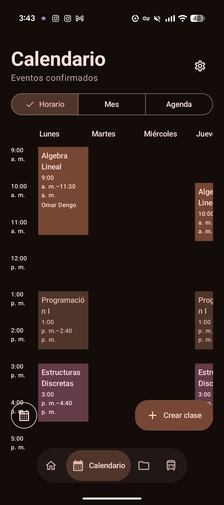
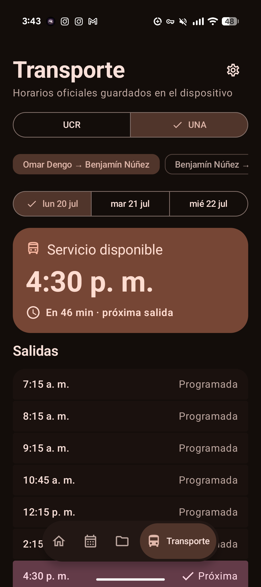
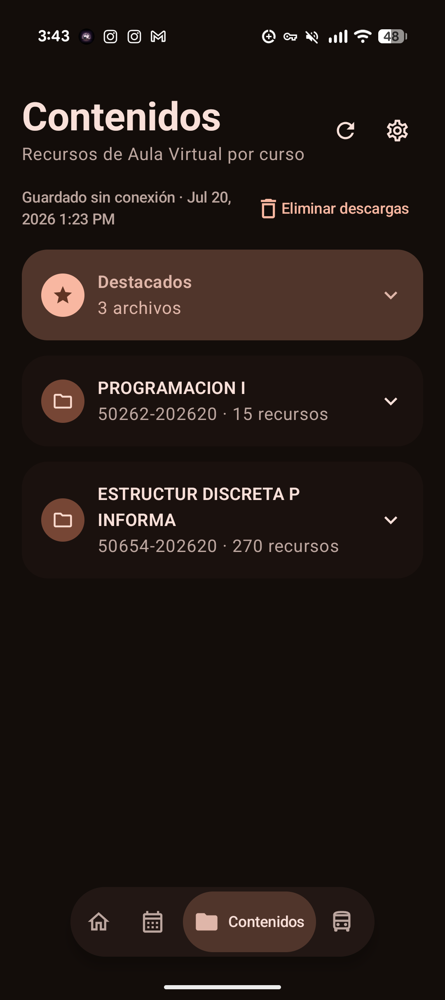
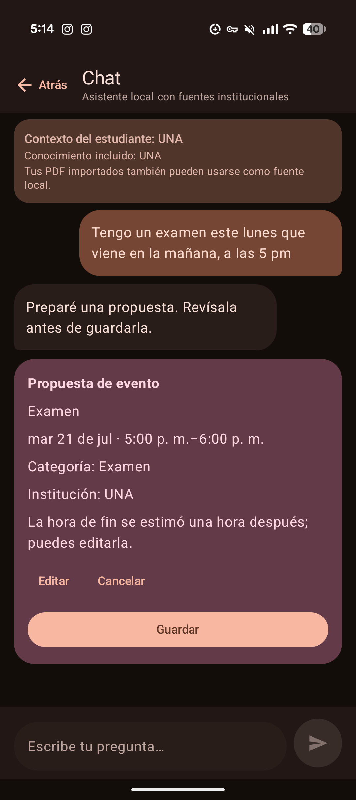
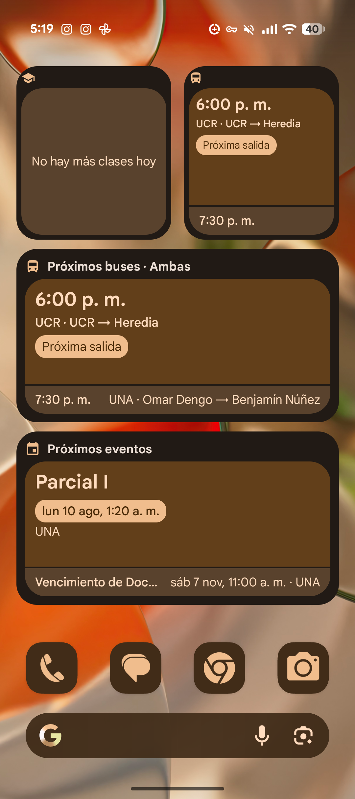

<div align="center">
  
  <h1>Mi Campus</h1>
  <p><strong>Tu vida universitaria, organizada y disponible aun sin conexión.</strong></p>
  <p>Una app Android en español para estudiantes de la UCR y la UNA.</p>

  <p>
    
    
    
    
  </p>
</div>

Mi Campus reúne calendario, horarios de transporte, materiales de curso, recordatorios y asistencia opcional con IA en una experiencia Material 3. Está diseñada para mantener los datos del estudiante en el dispositivo por defecto y funcionar sin una cuenta.

## Un vistazo a la app

<table>
  <tr>
    <td align="center"></td>
    <td align="center"></td>
    <td align="center"></td>
  </tr>
  <tr>
    <td align="center"><strong>Calendario</strong><br />Horario, mes y agenda en un solo lugar.</td>
    <td align="center"><strong>Transporte</strong><br />Horarios oficiales de UCR y UNA disponibles sin conexión.</td>
    <td align="center"><strong>Contenido</strong><br />Recursos de curso guardados en el dispositivo.</td>
  </tr>
</table>

<table>
  <tr>
    <td align="center"></td>
    <td align="center"></td>
  </tr>
  <tr>
    <td align="center"><strong>Asistente</strong><br />Propuestas editables; nada se guarda sin confirmación.</td>
    <td align="center"><strong>Widgets</strong><br />Clases, buses y eventos desde la pantalla de inicio.</td>
  </tr>
</table>

## Funciones principales

- Inicio guiado para seleccionar UCR, UNA o ambas instituciones.
- Agenda persistente con vistas de horario, mes y lista, filtros, edición, recordatorios y exportación idempotente al calendario de Android.
- Horarios de buses 2026 incluidos en la app, con fuente, cambios por fecha y avisos de vigencia ([servicio externo UCR](https://www.ucr.ac.cr/acerca-u/campus/bus-externo.html) y [servicio de periférica UNA](https://www.vidaestudiantil.una.ac.cr/noticias/2653-servicio-de-periferica-para-estudiantes-desde-el-campus-omar-dengo-al-campus-benjamin-nunez-y-viceversa)).
- Importación múltiple de PDF mediante el selector de archivos de Android, extracción de texto en API 35, OCR latino con ML Kit como respaldo, borradores editables y entrada manual.
- Biblioteca privada de documentos y contenido académico disponible sin conexión.
- Gemini Nano local y Google Gemini en la nube como opciones independientes y desactivadas por defecto, con consentimiento por lote o pregunta y clave cifrada proporcionada por el usuario.
- Temas claro, oscuro y de color dinámico, además de diseños compactos y expandidos.

> [!NOTE]
> No se incluyen entradas de calendario académico hasta contar con un conjunto de datos oficial y versionado. El conocimiento institucional integrado cubre actualmente material de la UNA; para consultas específicas de la UCR se necesita un documento importado relevante.

## Asistente y creación de eventos

El chat funciona incluso sin importar un PDF. Usa las instituciones seleccionadas como contexto privado sin modificar el mensaje visible del estudiante, filtra las fuentes por institución y solo abre enlaces `http` o `https` exactos encontrados en el material seleccionado.

Las expresiones de horario y los comandos `/crear-evento` o `/create-event` generan una propuesta editable. El estudiante debe confirmarla antes de que se guarde o programe cualquier recordatorio.

## Tecnología

| Área | Implementación |
| --- | --- |
| UI | Kotlin, Jetpack Compose y Material 3 |
| Datos locales | Room y DataStore |
| Tareas | WorkManager |
| IA local | Gemini Nano mediante AICore y ML Kit GenAI |
| Compatibilidad | Android API 26–36 |

## Compilar y verificar

Se necesita JDK 17 y un Android SDK con la plataforma 36:

```bash
./gradlew lint testDebugUnitTest assembleDebug
```

Con un emulador o dispositivo conectado:

```bash
./gradlew connectedDebugAndroidTest
```

GitHub Actions ejecuta lint, pruebas unitarias y la compilación de depuración. Las pruebas de dispositivo se pueden ejecutar localmente. Una etiqueta `v*` crea una GitHub Release firmada mediante los secretos configurados y adjunta el APK junto con su suma SHA-256. El APK de depuración queda en `app/build/outputs/apk/debug/app-debug.apk`.

## Privacidad por diseño

- La app funciona sin una cuenta.
- Los PDF se guardan únicamente en almacenamiento privado y excluido de copias de seguridad hasta que el estudiante los elimina.
- El texto extraído se almacena localmente en Room y se elimina junto con el PDF.
- Ambos procesadores de IA están desactivados en una instalación nueva.
- El procesamiento en la nube requiere una decisión nueva para cada lote de importación y cada pregunta del chat.
- El PDF original nunca se envía a la nube.

Consulta [PRIVACY.md](PRIVACY.md) e [IMPLEMENTATION_NOTES.md](IMPLEMENTATION_NOTES.md) para conocer los detalles técnicos y de tratamiento de datos.

## Gemini Nano en dispositivos compatibles

Mi Campus usa `com.google.mlkit:genai-prompt:1.0.0-beta3` mediante AICore y no incluye pesos del modelo. Las propuestas de eventos usan ML Kit Structured Output (`genai-schema-compiler:1.0.0-alpha1`) cuando el entorno lo admite y, en caso contrario, JSON restringido con validación estricta.

La compatibilidad se determina en tiempo de ejecución con `checkStatus()`. La primera descarga del modelo requiere conexión y confirmación explícita; después, la extracción de eventos puede funcionar sin conexión mientras Mi Campus permanece en primer plano.

La prueba opcional no inicia descargas, omite automáticamente dispositivos incompatibles y se ejecuta así cuando el modelo ya está disponible:

```bash
./gradlew connectedDebugAndroidTest -Pandroid.testInstrumentationRunnerArguments.runNanoDeviceTest=true
```

Las compilaciones de depuración también incluyen **Ajustes → Diagnóstico de importación** y la acción **Probar Gemini Nano**. El ZIP de diagnóstico contiene únicamente trazas permitidas y redactadas: nunca incluye texto de PDF, prompts, respuestas, nombres de documentos, claves API ni datos del calendario.
